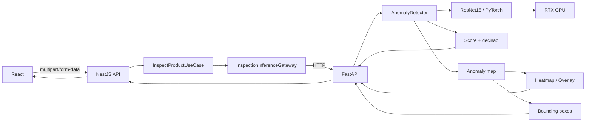
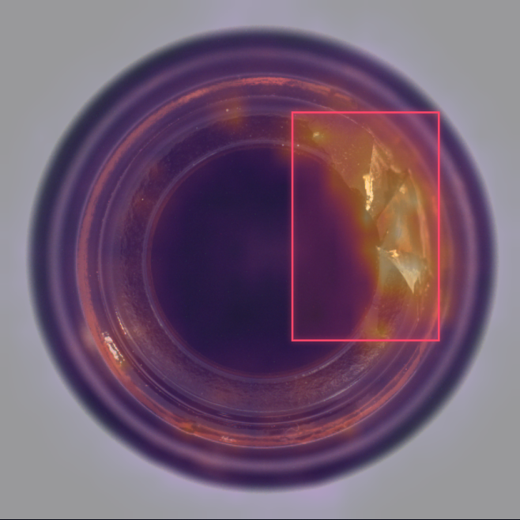
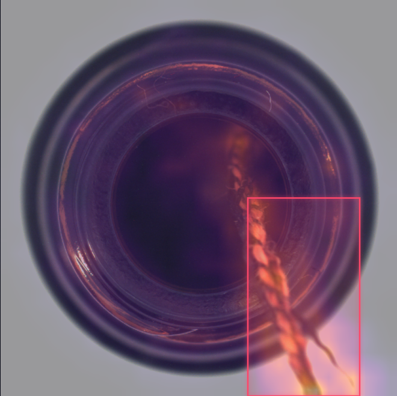
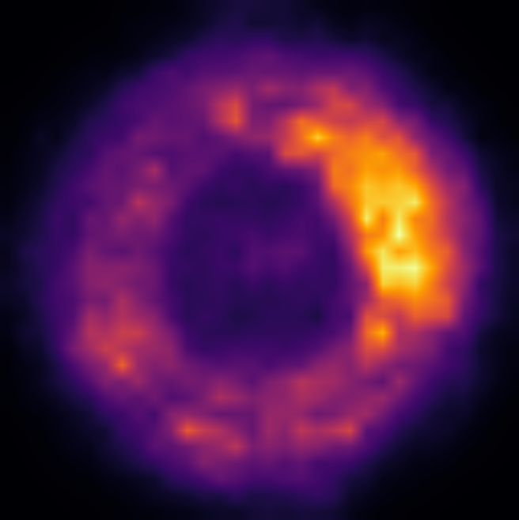

# VisionInspect — Industrial Anomaly Detection

Sistema web de inspeção visual industrial para detectar anomalias em produtos a partir de imagens.

O projeto usa **PyTorch + OpenCV** para inferência na GPU, uma API de inferência em **FastAPI**, um backend **NestJS + TypeScript** organizado com separação entre aplicação e infraestrutura, e um frontend **React + TypeScript**.

> O protótipo foi desenvolvido e avaliado com a categoria **Bottle** do dataset MVTec AD.

---

## Visão geral

O fluxo de uma inspeção é:



A interface permite:

- selecionar ou arrastar uma imagem;
- executar a inspeção;
- classificar a peça como **APPROVED** ou **REJECTED**;
- visualizar o **anomaly score** e o threshold;
- alternar entre imagem original, heatmap e overlay;
- destacar regiões suspeitas com bounding boxes.

---

## Interface e exemplos visuais

### Aplicação web

<p align="center">
  
  
</p>

### Exemplos de inspeção

<p align="center">
  
  
  
</p>

## Como o detector funciona

O detector usa uma **ResNet18 pré-treinada no ImageNet** como extrator de características.

A entrada é redimensionada para `256 × 256` e normalizada com os parâmetros associados aos pesos da ResNet18:

```python
mean = [0.485, 0.456, 0.406]
std = [0.229, 0.224, 0.225]
```

São utilizadas as features intermediárias da `layer2`:

```text
Imagem
  ↓
Preprocessamento
  ↓
ResNet18
  ↓
layer2
  ↓
Feature map [128, 32, 32]
  ↓
1024 vetores de 128 características
```

Durante a construção da referência, features extraídas de imagens sem defeito são armazenadas em um **memory bank**.

Na inspeção, cada patch da imagem é comparado com as referências normais pela distância Euclidiana. Para cada patch, é mantida a distância até a referência mais próxima.

O score final da imagem é a média dos **5% patches mais anômalos**.

```text
patches
  ↓
distância até referências normais
  ↓
score por patch
  ↓
ordenação dos scores
  ↓
média dos 5% maiores
  ↓
anomaly score
```

A decisão é:

```text
score <= threshold  → APPROVED
score >  threshold  → REJECTED
```

O threshold utilizado pelo protótipo é calibrado a partir de imagens normais, usando o **percentil 99** das pontuações de calibração.

---

## Localização das anomalias

Além da classificação da imagem, o detector produz um mapa espacial de anomalia.

Os patches mais anômalos são convertidos em uma máscara binária. Em seguida, são aplicados:

1. fechamento morfológico com OpenCV;
2. componentes conectados;
3. filtragem de componentes pequenos;
4. conversão das regiões para coordenadas da imagem original.

Essas regiões são retornadas como bounding boxes:

```json
{
  "x": 253,
  "y": 281,
  "width": 366,
  "height": 281
}
```

A localização é uma aproximação baseada no mapa `32 × 32`, portanto não deve ser interpretada como segmentação precisa por pixel.

---

## Resultados do protótipo

Avaliação realizada com as **83 imagens de teste** da categoria Bottle do MVTec AD:

| Métrica | Resultado |
|---|---:|
| Imagens avaliadas | 83 |
| Defeituosas | 63 |
| Normais | 20 |
| True Positives | 63 |
| True Negatives | 20 |
| False Positives | 0 |
| False Negatives | 0 |
| Accuracy | 100.00% |
| Recall / Defect detection rate | 100.00% |
| Precision | 100.00% |
| Specificity | 100.00% |
| False positive rate | 0.00% |
| F1 score | 100.00% |

### Tempo de processamento

Teste realizado em uma **NVIDIA GeForce RTX 3060 12 GB**:

| Medida | Resultado |
|---|---:|
| Tempo médio | 17.18 ms |
| Tempo mínimo | 10.20 ms |
| Tempo máximo observado | 92.28 ms |
| Throughput estimado | 58.19 imagens/s |

O benchmark mediu o pipeline de preprocessamento, transferência para GPU, extração de features, comparação com o memory bank e decisão. Ele não representa necessariamente a latência total de uma implantação industrial com câmera, rede, persistência e interface.

> **Importante:** 100% significa 100% **neste conjunto de teste e nesta configuração experimental**. Não implica 100% de desempenho em produção, com outras câmeras, produtos, iluminação, posicionamento ou distribuição de defeitos.

---

## Stack

### Visão computacional

- Python 3.11
- PyTorch
- torchvision
- OpenCV
- NumPy
- FastAPI
- Uvicorn

### Backend

- Node.js
- NestJS
- TypeScript
- Zod
- pnpm

### Frontend

- React
- TypeScript
- Vite
- Zod
- CSS

---

## Estrutura do projeto

```text
industrial-inspection/
├── backend/                    # API de aplicação NestJS
│   └── src/
│       ├── config/
│       └── inspection/
│           ├── application/
│           ├── infrastructure/
│           └── presentation/
├── frontend/                   # Interface React
│   └── src/
├── python/                     # Projeto Python independente
│   ├── pyproject.toml
│   ├── requirements.txt
│   ├── README.md
│   ├── src/vision_inspect/
│   │   ├── config.py
│   │   ├── detector.py
│   │   ├── visualization.py
│   │   ├── api/                # FastAPI e contratos HTTP
│   │   └── cli/                # Calibração, avaliação e diagnóstico
│   │       └── legacy/         # Experimentos anteriores
│   ├── tests/
│   ├── dados/                  # Dataset local
│   └── artifacts/              # Modelos e calibração
├── docs/
└── .gitignore
```

A instalação editável permite executar os módulos Python de qualquer pasta. Veja os detalhes, comandos de diagnóstico e testes no [README do serviço Python](./python/README.md).

O dataset e os artefatos gerados não são versionados:

```text
python/dados/
python/artifacts/
```

---

## Dataset

O projeto usa a categoria **Bottle** do [MVTec AD](https://www.mvtec.com/company/research/datasets/mvtec-ad).

O MVTec AD é disponibilizado sob **CC BY-NC-SA 4.0**. Verifique os termos oficiais antes de reutilizar o dataset, principalmente em contexto comercial.

Após baixar e extrair a categoria Bottle, a estrutura esperada é:

```text
python/dados/
└── mvtec/
    └── bottle/
        ├── train/
        │   └── good/
        ├── test/
        │   ├── broken_large/
        │   ├── broken_small/
        │   ├── contamination/
        │   └── good/
        └── ground_truth/
            ├── broken_large/
            ├── broken_small/
            └── contamination/
```

---

# Executando localmente

## 1. Clonar o repositório

```powershell
git clone https://github.com/thobiasgd/industrial-inspection.git
cd industrial-inspection
```

---

## 2. Criar o ambiente Python

No Windows:

```powershell
python -m venv python/.venv
```

Ative:

```powershell
Set-ExecutionPolicy -Scope Process -ExecutionPolicy RemoteSigned
.\python\.venv\Scripts\Activate.ps1
```

Atualize o pip:

```powershell
python -m pip install --upgrade pip
```

### PyTorch com CUDA

A configuração usada durante o desenvolvimento foi:

- PyTorch 2.10.0
- torchvision 0.25.0
- CUDA 12.6

```powershell
python -m pip install torch==2.10.0 torchvision==0.25.0 --index-url https://download.pytorch.org/whl/cu126
```

Depois instale o pacote Python e as dependências de desenvolvimento e visualização, a partir da raiz do repositório:

```powershell
python -m pip install -e "./python[dev,visualization]"
```

Verifique a GPU:

```powershell
python -m vision_inspect.cli.check_gpu
```

A aplicação atual exige CUDA disponível. Se você já possui uma `.venv` na raiz, pode reutilizá-la e executar apenas a instalação editável acima; não mova o ambiente virtual existente.

---

## 3. Gerar os artefatos do detector

Os arquivos `.pt` são gerados localmente e ficam em `python/artifacts/`, que é ignorado pelo Git.

### 3.1 Memory bank

Com o dataset Bottle em `python/dados/mvtec/bottle`:

```powershell
python -m vision_inspect.cli.build_memory_bank
```

Isso gera:

```text
python/artifacts/memory_bank.pt
```

O protótipo usa as primeiras 20 imagens normais ordenadas pelo nome como conjunto de referência.

### 3.2 Scores normais para calibração

```powershell
python -m vision_inspect.cli.collect_normal_scores_top5
```

Isso gera:

```text
python/artifacts/normal_scores_top5.pt
```

### 3.3 Threshold

```powershell
python -m vision_inspect.cli.calculate_threshold_top5
```

Isso gera:

```text
python/artifacts/threshold_top5.pt
```

---

## 4. Avaliar o detector

```powershell
python -m vision_inspect.cli.evaluate_test_set_top5
```

O script imprime:

- matriz de confusão;
- desempenho por categoria;
- accuracy;
- recall;
- precision;
- specificity;
- false positive rate;
- F1 score;
- tempo de processamento.

---

## 5. Iniciar a API Python

Na raiz:

```powershell
python -m uvicorn vision_inspect.api.app:app --host 127.0.0.1 --port 8000
```

Health check:

```powershell
curl.exe http://127.0.0.1:8000/health
```

Resposta esperada:

```json
{
  "status": "ready",
  "device": "cuda:0"
}
```

---

## 6. Iniciar o backend NestJS

Em outro terminal:

```powershell
cd backend
pnpm install
Copy-Item .env.example .env
pnpm start:dev
```

Configuração padrão:

```env
PORT=3050
INFERENCE_API_URL=http://127.0.0.1:8000
```

Status:

```powershell
curl.exe http://localhost:3050/inspections/status
```

---

## 7. Iniciar o frontend

Em outro terminal:

```powershell
cd frontend
pnpm install
Copy-Item .env.example .env
pnpm dev
```

Configuração padrão:

```env
VITE_API_URL=http://localhost:3050
```

Abra:

```text
http://localhost:5173
```

---

## Serviços em desenvolvimento

```text
React / Vite    → http://localhost:5173
NestJS          → http://localhost:3050
FastAPI/PyTorch → http://127.0.0.1:8000
```

---

## Exemplo de resposta da inspeção

O backend retorna um contrato semelhante a:

```json
{
  "score": 2.6701,
  "threshold": 2.2029,
  "decision": "REJECTED",
  "imageWidth": 900,
  "imageHeight": 900,
  "boundingBoxes": [
    {
      "x": 253,
      "y": 281,
      "width": 366,
      "height": 281
    }
  ],
  "heatmapBase64": "...",
  "overlayBase64": "..."
}
```

---

## Arquitetura do backend

O NestJS não conhece detalhes de PyTorch diretamente.

```text
InspectionController
        ↓
InspectProductUseCase
        ↓
InspectionInferenceGateway
        ↑
PythonInspectionInferenceGateway
        ↓
FastAPI
```

A camada de aplicação depende de um contrato (`InspectionInferenceGateway`). A implementação HTTP que conversa com Python fica na infraestrutura.

O gateway também adapta o contrato externo:

```text
Python / snake_case            Nest / camelCase

image_width             →      imageWidth
image_height            →      imageHeight
bounding_boxes          →      boundingBoxes
heatmap_base64          →      heatmapBase64
overlay_base64          →      overlayBase64
```

As respostas externas são validadas em runtime com **Zod**.

---

## Limitações atuais

Este é um projeto demonstrativo e possui limitações importantes:

- foi calibrado apenas para a categoria Bottle do MVTec AD;
- o memory bank é construído com um subconjunto fixo de imagens normais;
- o threshold foi calibrado para este dataset e esta configuração;
- iluminação, câmera, fundo e posicionamento diferentes podem alterar bastante os scores;
- bounding boxes são aproximações derivadas de um mapa espacial `32 × 32`;
- o heatmap é normalizado individualmente para visualização e suas cores não representam probabilidade;
- a aplicação exige atualmente uma GPU CUDA;
- os resultados do benchmark não incluem toda a latência de uma linha industrial real.

Para uso industrial real seria necessário, entre outros pontos, coletar dados do ambiente alvo, validar falsos positivos/falsos negativos em produção, definir requisitos de latência, tratar drift de distribuição e estabelecer um processo de recalibração.

---

## Próximas melhorias possíveis

- histórico persistente das inspeções;
- banco de dados para resultados;
- captura direta de câmera;
- métricas e dashboard de produção;
- calibração por produto;
- modelos/configurações por linha industrial;
- melhorias na localização de defeitos pequenos;
- testes automatizados de integração;
- containerização dos serviços;
- autenticação e controle de acesso.

---

## Motivação

O objetivo deste projeto é demonstrar um fluxo completo de visão computacional aplicado à inspeção industrial: da construção de uma referência de normalidade e inferência na GPU até uma interface web utilizável, mantendo a inferência desacoplada da API de aplicação.
