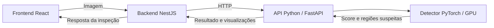

# VisionInspect

**Inspeção visual de produtos com detecção de anomalias e processamento na GPU.**

O VisionInspect é uma aplicação web que analisa imagens de produtos, identifica possíveis defeitos e apresenta as regiões suspeitas na interface. O projeto reúne visão computacional em Python, uma API de aplicação em NestJS e um frontend em React.

O protótipo foi desenvolvido com a categoria **Bottle** do dataset **MVTec AD**. O detector compara as características de uma imagem com referências de produtos sem defeito e retorna uma decisão de aprovação ou rejeição.

## A aplicação

<p align="center">
  
  
</p>

Na interface, é possível:

- selecionar uma imagem ou arrastá-la para a área de envio;
- executar a inspeção e consultar a decisão **APPROVED** ou **REJECTED**;
- comparar o score de anomalia com o limite de aprovação, chamado de threshold;
- alternar entre a imagem original, o mapa de calor e a sobreposição das anomalias;
- visualizar caixas delimitadoras sobre as regiões suspeitas.

### Exemplos de detecção

<p align="center">
  
  
  
</p>

## Como as partes se conectam



| Parte | Responsabilidade | Tecnologias principais |
| --- | --- | --- |
| Frontend | Envio de imagens e apresentação dos resultados | React, TypeScript, Vite e CSS |
| Backend | Recebimento das inspeções, comunicação com o serviço Python e validação das respostas | NestJS, TypeScript e Zod |
| Python | Preparação das referências, calibração, inferência e geração das visualizações | PyTorch, torchvision, OpenCV e FastAPI |

O detector utiliza uma **ResNet18 pré-treinada** para extrair características das imagens. As referências normais ficam armazenadas em um banco de características, o *memory bank*. A média dos 5% patches mais anômalos determina o score da imagem: valores acima do threshold resultam em **REJECTED**; os demais, em **APPROVED**.

## Organização do repositório

```text
industrial-inspection/
├── frontend/
├── backend/
├── python/
│   ├── src/vision_inspect/
│   ├── tests/
│   ├── dados/
│   ├── artifacts/
│   └── pyproject.toml
├── docs/images/
└── README.md
```

Os diretórios `python/dados/` e `python/artifacts/` são locais e ignorados pelo Git. Eles são preenchidos durante a preparação descrita abaixo.

## Executar localmente

As instruções usam **Windows e PowerShell**. Execute os comandos a partir da **raiz do repositório**, inclusive ao abrir novos terminais.

### 1. Pré-requisitos

| Requisito | Versão ou condição |
| --- | --- |
| Git | Instalado e disponível no terminal |
| Python | 3.11, versão usada no desenvolvimento |
| Node.js | 22.22.0, versão usada no desenvolvimento |
| pnpm | 10; ambiente validado com 10.22.0 |
| GPU | NVIDIA com driver compatível com o PyTorch CUDA 12.6 |
| Dataset | Categoria Bottle do MVTec AD |

A implementação atual exige CUDA para executar o detector. É necessário acesso à internet para instalar as dependências e baixar os pesos da ResNet18 na primeira execução, caso ainda não estejam em cache.

### 2. Clonar o projeto

```powershell
git clone https://github.com/thobiasgd/industrial-inspection.git
cd industrial-inspection
```

### 3. Preparar o ambiente Python

Crie e ative o ambiente virtual:

```powershell
python -m venv python/.venv
.\python\.venv\Scripts\Activate.ps1
```

Se o PowerShell bloquear a ativação, libere a execução de scripts para a sessão atual e tente novamente:

```powershell
Set-ExecutionPolicy -Scope Process -ExecutionPolicy RemoteSigned
.\python\.venv\Scripts\Activate.ps1
```

Instale primeiro o PyTorch com CUDA e, em seguida, o pacote do projeto:

```powershell
python -m pip install --upgrade pip
python -m pip install torch==2.10.0 torchvision==0.25.0 --index-url https://download.pytorch.org/whl/cu126
python -m pip install -e "./python[dev,visualization]"
python -m vision_inspect.cli.check_gpu
```

O último comando deve identificar a GPU e concluir o teste com sucesso.

Se você já utiliza uma `.venv` na raiz, pode ativá-la com `.\.venv\Scripts\Activate.ps1` e reutilizá-la para a instalação. Nos próximos passos, ative sempre o ambiente em que o pacote `vision-inspect` foi instalado.

### 4. Preparar o dataset e os artefatos

Baixe a categoria **Bottle** na [página oficial do MVTec AD](https://www.mvtec.com/company/research/datasets/mvtec-ad), onde também estão os termos de uso do dataset. Extraia os arquivos para obter esta estrutura:

```text
python/dados/mvtec/bottle/
├── train/
│   └── good/
├── test/
│   ├── broken_large/
│   ├── broken_small/
│   ├── contamination/
│   └── good/
└── ground_truth/
    ├── broken_large/
    ├── broken_small/
    └── contamination/
```

Com o ambiente Python ativo, execute os comandos nesta ordem:

```powershell
python -m vision_inspect.cli.build_memory_bank
python -m vision_inspect.cli.collect_normal_scores_top5
python -m vision_inspect.cli.calculate_threshold_top5
```

| Comando | Arquivo gerado em `python/artifacts/` |
| --- | --- |
| `build_memory_bank` | `memory_bank.pt` |
| `collect_normal_scores_top5` | `normal_scores_top5.pt` |
| `calculate_threshold_top5` | `threshold_top5.pt` |

A API precisa de `memory_bank.pt` e `threshold_top5.pt` para iniciar. Se você já possui esses artefatos gerados para esta configuração, pode reutilizá-los sem executar novamente a preparação.

### 5. Instalar e configurar backend e frontend

```powershell
pnpm --dir backend install --frozen-lockfile
pnpm --dir frontend install --frozen-lockfile
```

Crie os arquivos de ambiente a partir dos exemplos. Se já existirem, preserve os arquivos atuais e confira os valores abaixo.

```powershell
if (-not (Test-Path backend/.env)) {
    Copy-Item backend/.env.example backend/.env
}
if (-not (Test-Path frontend/.env)) {
    Copy-Item frontend/.env.example frontend/.env
}
```

Em `backend/.env`:

```env
PORT=3050
INFERENCE_API_URL=http://127.0.0.1:8000
```

Em `frontend/.env`:

```env
VITE_API_URL=http://localhost:3050
```

### 6. Iniciar os três serviços

Mantenha um terminal aberto para cada serviço, todos partindo da raiz do repositório.

**Terminal 1 — API Python**

```powershell
.\python\.venv\Scripts\Activate.ps1
python -m uvicorn vision_inspect.api.app:app --host 127.0.0.1 --port 8000
```

Se estiver reutilizando a `.venv` da raiz, substitua o comando de ativação por `.\.venv\Scripts\Activate.ps1`.

**Terminal 2 — backend**

```powershell
pnpm --dir backend start:dev
```

**Terminal 3 — frontend**

```powershell
pnpm --dir frontend dev --port 5173 --strictPort
```

| Serviço | Endereço |
| --- | --- |
| Interface web | [http://localhost:5173](http://localhost:5173) |
| Backend | [http://localhost:3050/inspections/status](http://localhost:3050/inspections/status) |
| Status do detector | [http://127.0.0.1:8000/health](http://127.0.0.1:8000/health) |
| Documentação da API Python | [http://127.0.0.1:8000/docs](http://127.0.0.1:8000/docs) |

A interface usa a porta `5173`, que está autorizada no CORS do backend. O parâmetro `--strictPort` evita que o Vite selecione outra porta silenciosamente.

### 7. Fazer a primeira inspeção

Abra [http://localhost:5173](http://localhost:5173), selecione uma imagem de `python/dados/mvtec/bottle/test/` e execute a inspeção. Use uma imagem de `good/` para testar uma peça normal ou de uma das demais categorias para testar defeitos.

Para conferir os serviços pelo terminal:

```powershell
curl.exe http://127.0.0.1:8000/health
curl.exe http://localhost:3050/inspections/status
```

A API Python deve responder com `status: ready` e `device: cuda:0`. O status do backend confirma que o módulo de inspeção está ativo; a disponibilidade do detector é verificada separadamente pelo endpoint `/health` do Python.

Também é possível enviar uma imagem diretamente ao backend, a partir da raiz:

```powershell
curl.exe -X POST http://localhost:3050/inspections -F "image=@python/dados/mvtec/bottle/test/contamination/000.png"
```

A resposta contém o score, o threshold, a decisão, as dimensões da imagem, as caixas delimitadoras e as visualizações codificadas em Base64.

## Verificações

Para avaliar o detector com as imagens do dataset, mantenha o ambiente Python ativo:

```powershell
python -m vision_inspect.cli.evaluate_test_set_top5
```

Para executar os testes automatizados e verificar a compilação das aplicações:

```powershell
python -m pytest python/tests
pnpm --dir backend test
pnpm --dir backend build
pnpm --dir frontend build
```

Os testes automatizados Python utilizam um detector simulado. A avaliação do dataset executa a inferência real e requer GPU e artefatos.

## Resultados e escopo do protótipo

A avaliação local com as **83 imagens de teste da categoria Bottle** apresentou:

| Resultado | Quantidade |
| --- | ---: |
| Imagens defeituosas corretamente rejeitadas | 63 |
| Imagens normais corretamente aprovadas | 20 |
| Falsos positivos | 0 |
| Falsos negativos | 0 |
| Acurácia nesse conjunto | 100% |

Esses resultados se referem ao dataset e à configuração avaliados. O uso com outros produtos, câmeras ou condições de iluminação exige novas referências, calibração e validação. As caixas delimitadoras representam uma localização aproximada, e as cores do mapa de calor não representam probabilidades.

## Problemas comuns ao iniciar

| Situação | O que verificar |
| --- | --- |
| `CUDA is not available` | Execute `python -m vision_inspect.cli.check_gpu` no ambiente ativo e confira a instalação do PyTorch com CUDA e o driver da GPU. |
| `Memory bank not found` ou `Threshold not found` | Confira os arquivos em `python/artifacts/` e execute a preparação na ordem indicada. |
| `No module named vision_inspect` | Ative o ambiente correto e execute `python -m pip install -e "./python[dev,visualization]"` na raiz. |
| A interface abre, mas a inspeção falha | Confira os três serviços, as URLs dos arquivos `.env` e o endpoint Python `/health`. |
| Porta `5173` ocupada | Libere a porta antes de iniciar o frontend; outra porta também exigiria ajustar o CORS do backend. |

## Documentação por componente

- [Frontend](./frontend/README.md)
- [Backend](./backend/README.md)
- [Python](./python/README.md)
