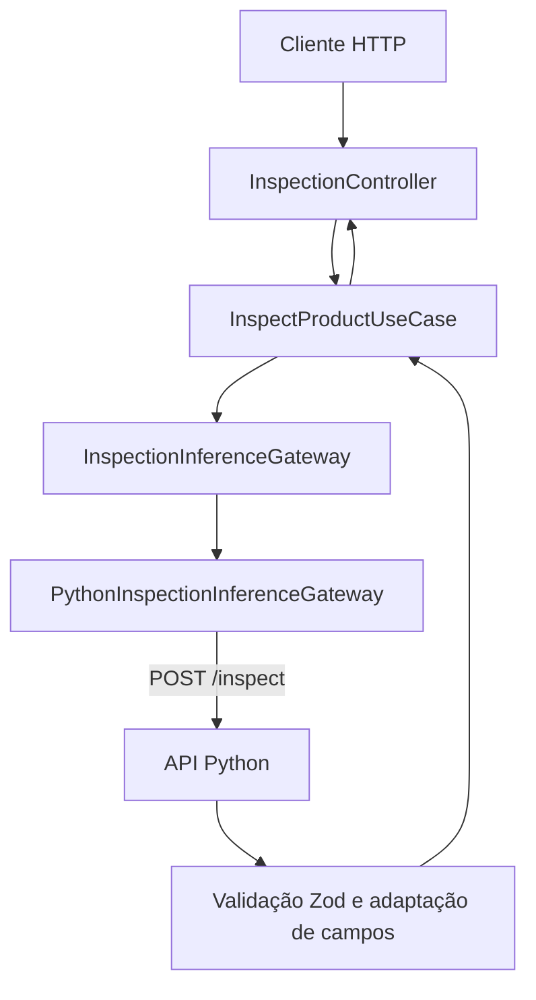

# VisionInspect — Backend

API de aplicação do VisionInspect, desenvolvida com **NestJS e TypeScript**. O backend recebe imagens do frontend, solicita a inferência ao serviço Python e devolve o resultado em um contrato próprio, validado com Zod.

Para preparar e executar o projeto completo, consulte o [README principal](../README.md). A configuração do detector e da GPU está no [README do Python](../python/README.md).

## Responsabilidades

- Receber imagens por upload `multipart/form-data`.
- Executar os casos de uso do módulo de inspeção.
- Encaminhar a imagem para a API Python por HTTP.
- Validar e adaptar a resposta de inferência para o frontend.
- Expor o status do módulo de inspeção.

O processamento de imagens e a decisão de aprovação ou rejeição são realizados pelo Python. O backend pode iniciar e responder ao endpoint de status sem que o detector esteja disponível; a inspeção depende do serviço de inferência.

## Tecnologias

| Tecnologia | Uso |
| --- | --- |
| NestJS 12 | Módulos, controllers, injeção de dependências e servidor HTTP |
| TypeScript 6 | Tipagem e compilação do código |
| `@nestjs/config` | Carregamento e validação das variáveis de ambiente |
| Zod | Validação da configuração e da resposta externa |
| Multer / `FileInterceptor` | Recebimento do arquivo enviado pelo cliente |
| `fetch`, `FormData` e `Blob` do Node.js | Comunicação HTTP com a API Python |
| Vitest e Supertest | Testes unitários e testes HTTP |
| pnpm | Instalação de dependências e execução dos scripts |

As versões e os scripts estão definidos em [package.json](./package.json), com as resoluções de dependências registradas em [pnpm-lock.yaml](./pnpm-lock.yaml).

## Executar localmente

Os comandos abaixo usam PowerShell. Entre na pasta `backend/` a partir da raiz do repositório:

```powershell
cd backend
```

Execute os demais comandos deste documento dentro dessa pasta. O ambiente de desenvolvimento foi validado com **Node.js 22.22.0** e **pnpm 10.22.0**.

### 1. Instalar as dependências

```powershell
pnpm install --frozen-lockfile
```

### 2. Configurar o ambiente

Crie o arquivo `.env` se ele ainda não existir:

```powershell
if (-not (Test-Path .env)) {
    Copy-Item .env.example .env
}
```

A configuração de exemplo é:

```env
PORT=3050
INFERENCE_API_URL=http://127.0.0.1:8000
```

| Variável | Obrigatória | Valor de exemplo | Finalidade |
| --- | --- | --- | --- |
| `PORT` | Sim | `3050` | Porta HTTP do backend; deve ser um inteiro de 1 a 65535 |
| `INFERENCE_API_URL` | Sim | `http://127.0.0.1:8000` | URL base da API Python |

Use a URL base do Python sem o sufixo `/inspect`; o gateway acrescenta esse caminho à requisição. Os valores de exemplo não são defaults definidos no código: as variáveis precisam estar no `.env` ou no ambiente do processo.

O [schema de configuração](./src/config/env.schema.ts) é validado ao iniciar a aplicação. Valores ausentes ou inválidos impedem a inicialização.

### 3. Iniciar o backend

```powershell
pnpm start:dev
```

O modo de desenvolvimento recompila e reinicia a aplicação ao alterar o código. Com o `.env` de exemplo, o backend fica disponível em `http://localhost:3050`.

Antes de enviar imagens, inicie também a API Python conforme o [guia de execução do projeto](../README.md). Ela deve estar acessível no endereço definido em `INFERENCE_API_URL`.

### 4. Conferir o status

```powershell
curl.exe http://localhost:3050/inspections/status
```

Resposta esperada, com HTTP **200**:

```json
{
  "status": "ready",
  "message": "Inspection module is running"
}
```

Essa resposta confirma que o módulo NestJS está ativo. Para verificar o detector, consulte o endpoint do Python no endereço configurado:

```powershell
curl.exe http://127.0.0.1:8000/health
```

### Executar a versão compilada

```powershell
pnpm build
pnpm start:prod
```

O build gera `dist/main.js`. O comando `start:prod` executa o código compilado e também precisa das variáveis de ambiente configuradas.

## Rotas HTTP

As rotas registradas pelo módulo de inspeção são:

| Método | Rota | Finalidade | Resposta de sucesso |
| --- | --- | --- | --- |
| `GET` | `/inspections/status` | Consultar o status do módulo | `200 OK` |
| `POST` | `/inspections` | Enviar uma imagem para inspeção | `201 Created` |

O `POST` utiliza o status padrão do NestJS. A aplicação não persiste uma inspeção em banco de dados ao responder `201`.

### Enviar uma imagem

Envie o arquivo no campo **`image`**, usando `multipart/form-data`. O controller recebe os bytes em memória e cria o DTO de entrada do caso de uso.

Exemplo executado dentro de `backend/`, com o dataset preparado:

```powershell
curl.exe -X POST http://localhost:3050/inspections -F "image=@../python/dados/mvtec/bottle/test/contamination/000.png"
```

No navegador, use `FormData` e deixe o cliente HTTP definir o cabeçalho `Content-Type` e seu boundary.

### Resposta da inspeção

Exemplo ilustrativo, com o conteúdo Base64 abreviado:

```json
{
  "score": 2.6701,
  "threshold": 2.2029,
  "decision": "REJECTED",
  "imageWidth": 900,
  "imageHeight": 900,
  "boundingBoxes": [
    {
      "x": 253,
      "y": 281,
      "width": 366,
      "height": 281
    }
  ],
  "heatmapBase64": "...",
  "overlayBase64": "..."
}
```

| Campo | Descrição |
| --- | --- |
| `score` | Score de anomalia calculado pelo detector |
| `threshold` | Limite de classificação utilizado na inferência |
| `decision` | `APPROVED` ou `REJECTED` |
| `imageWidth`, `imageHeight` | Dimensões da imagem original, em pixels |
| `boundingBoxes` | Regiões suspeitas; cada caixa contém `x`, `y`, `width` e `height` em pixels |
| `heatmapBase64` | Imagem PNG do mapa de calor codificada em Base64 |
| `overlayBase64` | Imagem PNG da sobreposição codificada em Base64 |

As strings Base64 chegam sem o prefixo de data URL. Para exibir uma visualização no frontend, acrescente `data:image/png;base64,` ao conteúdo recebido.

### Respostas de erro atuais

| Situação | HTTP | Comportamento |
| --- | --- | --- |
| Nenhum arquivo no campo `image` | `400` | O controller responde com a mensagem `Image is required.` |
| Arquivo recebido com zero bytes | `500` | O caso de uso lança `Image cannot be empty.`, sem conversão para uma exceção HTTP específica |
| Falha de conexão com o Python | `500` | A falha do gateway é tratada como erro interno |
| Resposta HTTP de erro do Python | `500` | O gateway lança um erro; o status externo não é repassado diretamente ao cliente |
| Resposta do Python incompatível com o schema | `500` | A validação Zod falha e interrompe a resposta da inspeção |

Nos casos tratados como erro interno, a resposta padrão do NestJS usa `Internal server error`; os detalhes da falha ficam nos logs do servidor. A validação do conteúdo da imagem ocorre no serviço Python.

## Arquitetura

O módulo de inspeção separa a entrada HTTP, os casos de uso e a integração externa:



| Camada | Local | Responsabilidade |
| --- | --- | --- |
| Apresentação | `inspection/presentation/controllers/` | Receber o upload, validar a presença do arquivo e chamar os casos de uso |
| Aplicação | `inspection/application/use-cases/` | Coordenar a inspeção e a consulta de status |
| Contratos de aplicação | `inspection/application/dto/` e `ports/` | Definir entradas, saídas e a interface de inferência |
| Infraestrutura | `inspection/infrastructure/inference/` | Integrar com o Python e validar seu contrato de resposta |
| Composição | `inspection/inspection.module.ts` | Registrar controllers e conectar as implementações por injeção de dependências |

### Integração com o Python

O [caso de uso de inspeção](./src/inspection/application/use-cases/inspect-product.use-case.ts) depende da interface `InspectionInferenceGateway`. O [módulo](./src/inspection/inspection.module.ts) utiliza o token `INSPECTION_INFERENCE_GATEWAY` para injetar a implementação HTTP.

O [gateway Python](./src/inspection/infrastructure/inference/python-inspection-inference.gateway.ts):

1. Recebe o `Buffer` da imagem.
2. Monta um `FormData` com o campo `image`.
3. Envia a requisição para `${INFERENCE_API_URL}/inspect`.
4. Valida o JSON com o [schema de resposta](./src/inspection/infrastructure/inference/schemas/python-inspection-response.schema.ts).
5. Adapta os nomes dos campos de `snake_case` para `camelCase`.

| API Python | Resposta do backend |
| --- | --- |
| `image_width` | `imageWidth` |
| `image_height` | `imageHeight` |
| `bounding_boxes` | `boundingBoxes` |
| `heatmap_base64` | `heatmapBase64` |
| `overlay_base64` | `overlayBase64` |

`score`, `threshold` e `decision` mantêm os mesmos nomes. O backend utiliza o resultado de classificação recebido do Python.

Também existe um `FakeInspectionInferenceGateway`, que retorna dados fixos e strings vazias para as visualizações. Ele está disponível para substituição do provider em testes, mas não está registrado como implementação ativa no módulo e não é selecionado por uma variável de ambiente.

## Estrutura

```text
backend/
├── src/
│   ├── main.ts
│   ├── app.module.ts
│   ├── app.controller.ts
│   ├── app.controller.spec.ts
│   ├── app.service.ts
│   ├── config/
│   │   ├── env.schema.ts
│   │   └── env.validation.ts
│   └── inspection/
│       ├── inspection.module.ts
│       ├── application/
│       │   ├── dto/
│       │   ├── ports/
│       │   └── use-cases/
│       ├── infrastructure/
│       │   └── inference/
│       │       └── schemas/
│       └── presentation/
│           └── controllers/
├── test/
│   └── app.e2e-spec.ts
├── .env.example
├── nest-cli.json
├── package.json
├── pnpm-lock.yaml
├── tsconfig.json
├── tsconfig.build.json
├── vitest.config.ts
└── vitest.config.e2e.ts
```

`AppController` e `AppService` são remanescentes do template inicial. Eles não estão registrados no `AppModule` atual, portanto `GET /` responde `404`.

## CORS

A origem autorizada está definida em [src/main.ts](./src/main.ts):

```text
http://localhost:5173
```

Se o frontend utilizar outra origem, ajuste `app.enableCors` nesse arquivo. Essa configuração não está vinculada a uma variável de ambiente. O endereço `VITE_API_URL` do frontend deve apontar para o backend, normalmente `http://localhost:3050`.

## Scripts e testes

| Comando | Finalidade |
| --- | --- |
| `pnpm start:dev` | Executar com recompilação e reinício automático |
| `pnpm start` | Compilar e iniciar pelo CLI do NestJS |
| `pnpm start:debug` | Executar em modo de depuração e observar alterações |
| `pnpm build` | Compilar para `dist/` |
| `pnpm start:prod` | Executar o build existente |
| `pnpm lint` | Analisar o código com Oxlint e verificação de tipos |
| `pnpm format` | Formatar os arquivos de código e testes com Prettier |
| `pnpm test` | Executar os testes unitários existentes |
| `pnpm test:watch` | Executar os testes em modo de observação |
| `pnpm test:cov` | Executar os testes e gerar cobertura |
| `pnpm test:e2e` | Executar a suíte E2E existente |

### Estado atual da cobertura

O teste unitário em `src/app.controller.spec.ts` verifica o retorno `Hello World!` do controller original, instanciado isoladamente. Ele não cobre o fluxo de inspeção nem a integração com o Python.

O teste em `test/app.e2e-spec.ts` ainda espera que `GET /` retorne `200` e `Hello World!`. Como essa rota não está registrada no módulo atual, `pnpm test:e2e` falha com **404 em vez de 200**, mesmo com as variáveis de ambiente configuradas. A suíte precisa ser atualizada para as rotas de inspeção.

Para uma verificação manual do fluxo real, mantenha o Python ativo e use os exemplos de `GET /inspections/status` e `POST /inspections` deste documento.

## Problemas comuns

| Sintoma | O que verificar |
| --- | --- |
| Aplicação não inicia e mostra erro de configuração | Presença e validade de `PORT` e `INFERENCE_API_URL` no `.env` ou no ambiente |
| `EADDRINUSE` ao iniciar | Outro processo está utilizando a porta definida em `PORT` |
| Status retorna `ready`, mas a inspeção falha | Disponibilidade do Python, seu endpoint `/health` e os logs do gateway |
| `Image is required.` | O upload deve usar `multipart/form-data` com um arquivo no campo `image` |
| Erro de CORS no navegador | A origem do frontend deve corresponder à origem autorizada em `src/main.ts` |
| `GET /` retorna `404` | Utilize as rotas `/inspections/status` e `/inspections` |
| `pnpm start:prod` não encontra `dist/main` | Execute `pnpm build` antes de iniciar a versão compilada |

## Documentação relacionada

- [Apresentação e execução do projeto](../README.md)
- [Serviço Python](../python/README.md)
- [Frontend](../frontend/README.md)
