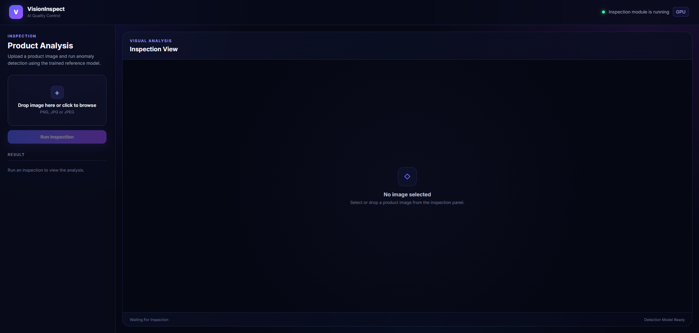
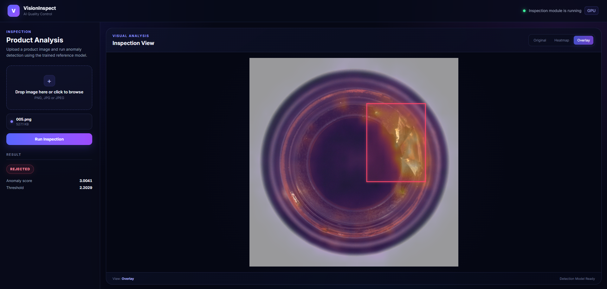
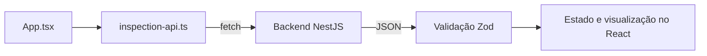

# VisionInspect — Frontend

Interface web do VisionInspect, desenvolvida com **React, TypeScript e Vite**. Permite enviar imagens de produtos para inspeção, consultar a classificação e visualizar as regiões suspeitas identificadas pelo detector.

O frontend se comunica com o backend NestJS. A inferência é executada pelo serviço Python, acessado pelo backend. Para preparar os três serviços, consulte o [README principal](../README.md).

## Interface

<p align="center">
  
  
</p>

A tela reúne três áreas:

| Área | Conteúdo |
| --- | --- |
| Barra superior | Identificação da aplicação e mensagem de status recebida do backend |
| Painel lateral | Seleção da imagem, ação de inspeção, mensagens de erro, decisão, score e threshold |
| Área de visualização | Imagem selecionada, abas de resultado, caixas delimitadoras e indicador de processamento |

Os textos da interface estão atualmente em inglês.

## Tecnologias

| Tecnologia | Uso |
| --- | --- |
| React 19 | Componentes, estado local e ciclo de vida da interface |
| TypeScript 6 | Tipagem dos eventos, estados e contratos de resposta |
| Vite 8 | Servidor de desenvolvimento e build dos arquivos estáticos |
| Zod 4 | Validação das respostas do backend em tempo de execução |
| CSS | Layout, tema, estados visuais e animação de carregamento |
| ESLint | Análise estática do código e regras de React Hooks |
| pnpm | Gerenciamento de dependências e execução dos scripts |

As dependências e os comandos estão definidos em [package.json](./package.json), com as versões resolvidas em [pnpm-lock.yaml](./pnpm-lock.yaml).

## Executar localmente

Os comandos abaixo usam PowerShell. A partir da raiz do repositório, entre na pasta do frontend:

```powershell
cd frontend
```

Execute os demais comandos deste documento dentro de `frontend/`. O ambiente foi validado com **Node.js 22.22.0** e **pnpm 10.22.0**.

### 1. Instalar as dependências

```powershell
pnpm install --frozen-lockfile
```

### 2. Configurar a URL do backend

Crie o arquivo `.env` se ele ainda não existir:

```powershell
if (-not (Test-Path .env)) {
    Copy-Item .env.example .env
}
```

Configure a variável:

```env
VITE_API_URL=http://localhost:3050
```

| Variável | Finalidade |
| --- | --- |
| `VITE_API_URL` | URL base do backend NestJS, acessível pelo navegador |

Informe a URL base sem o caminho `/inspections` e sem barra ao final. O cliente HTTP acrescenta as rotas às requisições. Essa variável deve apontar para o backend, não para a API Python.

O valor é lido por `import.meta.env.VITE_API_URL`. Não há URL alternativa definida no código nem validação dessa configuração ao iniciar a interface. Após editar o `.env`, reinicie o servidor de desenvolvimento.

### 3. Iniciar a interface

```powershell
pnpm dev --port 5173 --strictPort
```

Abra [http://localhost:5173](http://localhost:5173).

O backend autoriza a origem `http://localhost:5173` no CORS. O parâmetro `--strictPort` impede que o Vite escolha outra porta automaticamente se a `5173` estiver ocupada. Use também `localhost` no navegador para manter a origem configurada.

Para executar inspeções, mantenha o [backend](../backend/README.md) e o [serviço Python](../python/README.md) ativos. O frontend pode abrir sem eles, mas a consulta de status e a análise da imagem dependem desses serviços.

## Fluxo de utilização

1. Ao abrir a tela, a aplicação consulta `GET /inspections/status` e apresenta a mensagem do backend na barra superior.
2. Selecione uma imagem pela área de upload ou arraste um arquivo até ela. O nome, o tamanho em KB e a prévia local aparecem na interface.
3. Clique em **Run Inspection**. Durante a requisição, o botão mostra **Analyzing...** e a área de visualização exibe um indicador de processamento.
4. Após a resposta, a interface apresenta **APPROVED** ou **REJECTED**, o score e o threshold com quatro casas decimais.
5. A aba **Overlay** é selecionada automaticamente. Use as abas para comparar as visualizações.
6. Ao selecionar outra imagem válida, o resultado anterior é limpo e a visualização volta para **Original**.

O botão de inspeção fica desabilitado enquanto não houver arquivo selecionado ou enquanto uma inspeção estiver em andamento.

### Seleção da imagem

A interface sugere PNG, JPG ou JPEG. O seletor usa `accept="image/*"`, e a validação local verifica se o tipo MIME do arquivo começa com `image/`. Essa verificação não garante que o conteúdo possa ser decodificado pelo detector.

A aplicação utiliza o primeiro arquivo selecionado ou arrastado. A prévia é criada no navegador com `URL.createObjectURL`; a imagem só é enviada ao backend quando a inspeção é solicitada.

### Modos de visualização

| Aba | Conteúdo |
| --- | --- |
| **Original** | Prévia do arquivo selecionado no navegador |
| **Heatmap** | PNG do mapa de calor retornado pela API |
| **Overlay** | PNG com as anomalias sobrepostas à imagem |

O frontend transforma as strings Base64 da resposta em data URLs, acrescentando o prefixo `data:image/png;base64,`.

As caixas delimitadoras são desenhadas em uma camada SVG somente quando a decisão é **REJECTED**, a aba **Overlay** está ativa e há regiões em `boundingBoxes`. O `viewBox` utiliza `imageWidth` e `imageHeight` para representar as coordenadas da imagem original.

### Status apresentado na tela

A mensagem da barra superior vem do backend. Enquanto não houver uma resposta válida, a tela mostra **Connecting...**. A consulta ocorre na montagem do componente; não há monitoramento periódico nem reconexão automática.

O selo **GPU** e o texto **Detection model ready** são textos fixos da interface. Eles não indicam uma verificação em tempo real do detector. Para confirmar sua disponibilidade, consulte o endpoint `/health` da API Python, conforme o [guia do projeto](../README.md).

## Integração com o backend

A comunicação está concentrada em [src/services/inspection-api.ts](./src/services/inspection-api.ts).



| Função | Requisição | Uso |
| --- | --- | --- |
| `getInspectionStatus()` | `GET /inspections/status` | Consultar o status ao abrir a interface |
| `inspectProduct(image)` | `POST /inspections` | Enviar a imagem selecionada e obter o resultado |

O upload utiliza `FormData` com o arquivo no campo `image`. O navegador define o cabeçalho `Content-Type` com o boundary necessário ao `multipart/form-data`.

### Contratos consumidos

A resposta de status deve conter `status` e `message`, ambos strings. O resultado da inspeção utiliza os seguintes campos:

| Campo | Tipo esperado | Uso na interface |
| --- | --- | --- |
| `score` | Número | Score de anomalia |
| `threshold` | Número | Limite utilizado na classificação |
| `decision` | `APPROVED` ou `REJECTED` | Texto e estilo da decisão |
| `imageWidth`, `imageHeight` | Números positivos | Dimensões de referência da camada SVG |
| `boundingBoxes` | Lista de caixas | Regiões com `x`, `y`, `width` e `height` |
| `heatmapBase64` | String | Imagem do mapa de calor |
| `overlayBase64` | String | Imagem de sobreposição |

Cada caixa deve ter coordenadas não negativas e dimensões positivas. Os tipos `InspectionStatus` e `InspectionResult` são inferidos dos schemas Zod. A interface valida a estrutura dos dados recebidos e utiliza a decisão calculada pelo detector.

Para exemplos completos de requisições e respostas, consulte o [contrato HTTP do backend](../backend/README.md).

### Tratamento de erros

Quando uma requisição retorna um status HTTP de erro, o cliente lança uma mensagem com esse status. Ele não extrai a mensagem detalhada do corpo de erro do backend. Respostas JSON incompatíveis com os schemas também interrompem o processamento.

As mensagens são exibidas no painel lateral. Os detalhes de conexão e resposta podem ser consultados na aba **Network** das ferramentas de desenvolvimento do navegador e nos logs dos serviços.

## Organização do código

```text
frontend/
├── public/
│   ├── favicon.svg
│   └── icons.svg
├── src/
│   ├── assets/
│   ├── services/
│   │   └── inspection-api.ts
│   ├── App.tsx
│   ├── App.css
│   ├── index.css
│   └── main.tsx
├── .env.example
├── eslint.config.js
├── index.html
├── package.json
├── pnpm-lock.yaml
├── tsconfig.json
├── tsconfig.app.json
├── tsconfig.node.json
└── vite.config.ts
```

| Arquivo | Responsabilidade |
| --- | --- |
| [src/main.tsx](./src/main.tsx) | Montar a aplicação React em `StrictMode` e carregar os estilos globais |
| [src/App.tsx](./src/App.tsx) | Compor a tela e gerenciar seleção, resultado, carregamento, erros e aba ativa |
| [src/services/inspection-api.ts](./src/services/inspection-api.ts) | Fazer as requisições HTTP e validar os dados recebidos |
| [src/App.css](./src/App.css) | Definir tema, layout, componentes visuais e ajustes de largura |
| [src/index.css](./src/index.css) | Definir dimensões e margens dos elementos raiz |
| [index.html](./index.html) | Definir o elemento de montagem, título e favicon da página |
| [vite.config.ts](./vite.config.ts) | Configurar o Vite e o plugin React |

A aplicação atual possui uma única tela. O estado fica nos hooks do componente `App`; não há roteamento nem histórico persistente das inspeções. Recarregar a página descarta a seleção e o resultado exibido.

O layout mantém um painel lateral e uma área de visualização. O CSS contém ajustes nas larguras de `1050px` e `820px`, e as imagens usam `object-fit: contain` para preservar suas proporções.

## Scripts e build

| Comando | Finalidade |
| --- | --- |
| `pnpm dev` | Iniciar o servidor de desenvolvimento do Vite |
| `pnpm build` | Verificar os tipos com TypeScript e gerar o build em `dist/` |
| `pnpm lint` | Executar a análise estática com ESLint |
| `pnpm preview` | Servir localmente um build já gerado |

### Gerar e conferir o build

```powershell
pnpm lint
pnpm build
```

Para visualizar o build localmente, encerre o servidor de desenvolvimento e execute:

```powershell
pnpm preview --port 5173 --strictPort
```

Abra [http://localhost:5173](http://localhost:5173). Esse comando usa a mesma origem autorizada no backend. O preview serve o conteúdo de `dist/` para conferência local; o backend e o Python continuam sendo executados separadamente.

O Vite incorpora `VITE_API_URL` ao código gerado no build. Para mudar a API utilizada pelos arquivos compilados, ajuste a variável e execute `pnpm build` novamente.

## Verificação manual

O frontend ainda não possui uma suíte de testes automatizados nem um script `test` no `package.json`. Além de `pnpm lint` e `pnpm build`, o fluxo pode ser conferido com os três serviços ativos:

1. Abra a interface e confira a mensagem de status do backend.
2. Selecione uma imagem de `python/dados/mvtec/bottle/test/good/`, a partir da raiz do repositório, e verifique a prévia antes do envio.
3. Execute a inspeção e confira a decisão, o score e o threshold.
4. Selecione uma imagem de `broken_large/`, `broken_small/` ou `contamination/` e execute novamente.
5. Alterne entre **Original**, **Heatmap** e **Overlay**. Para um resultado rejeitado com regiões detectadas, confira as caixas na aba **Overlay**.
6. Selecione outra imagem e confirme que o resultado anterior foi limpo.

## Problemas comuns

| Sintoma | O que verificar |
| --- | --- |
| A interface permanece em `Connecting...` | Disponibilidade do backend, valor de `VITE_API_URL` e mensagem de erro no painel; recarregue a página após restabelecer o serviço |
| Erro de CORS | A página deve usar a origem autorizada no backend, atualmente `http://localhost:5173` |
| Falha de inspeção com status `500` | Logs do backend e disponibilidade do detector no endpoint Python `/health` |
| Alteração do `.env` não aparece | Reinicie o Vite em desenvolvimento ou gere novamente o build para o preview |
| `The selected file must be an image.` | O tipo MIME informado pelo navegador não começa com `image/` |
| O botão de inspeção está desabilitado | Selecione uma imagem e aguarde o fim da requisição em andamento |
| As caixas não aparecem | Elas são exibidas somente em **Overlay**, com decisão **REJECTED** e `boundingBoxes` não vazio |
| A porta `5173` está ocupada | Encerre o outro processo antes de iniciar o servidor ou o preview |
| A API respondeu, mas a interface mostra erro de validação | Compare o JSON recebido com os schemas de `inspection-api.ts` |

## Documentação relacionada

- [Apresentação e execução do projeto](../README.md)
- [Backend e contrato HTTP](../backend/README.md)
- [Serviço Python](../python/README.md)
