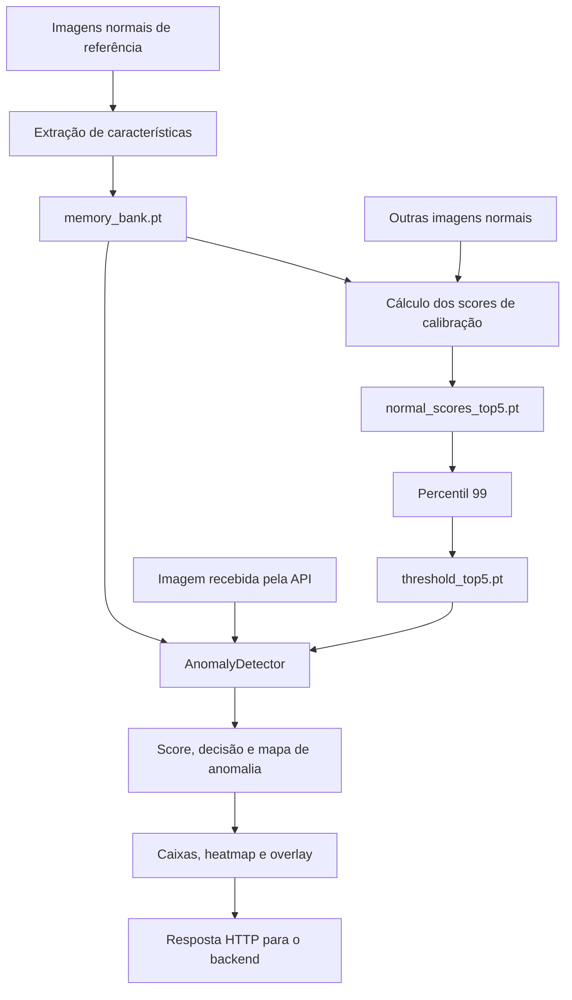

# VisionInspect — Python e detecção de anomalias

Este é o núcleo de visão computacional do **VisionInspect**. O projeto Python constrói as referências de produtos sem defeito, calibra o limite de classificação, executa a inferência na GPU e gera os resultados consumidos pela aplicação web.

O objetivo deste documento é explicar tanto **como executar o serviço** quanto **como cada resultado é calculado**. Os parâmetros descritos correspondem à implementação atual, preparada para a categoria **Bottle** do dataset MVTec AD.

Para executar a aplicação completa, consulte o [README principal](../README.md). Os contratos de integração com a interface estão documentados no [backend](../backend/README.md) e no [frontend](../frontend/README.md).

## Índice

- [Papel deste serviço](#papel-deste-serviço)
- [Instalação e ambiente](#instalação-e-ambiente)
- [Dados e caminhos](#dados-e-caminhos)
- [Preparação e calibração](#preparação-e-calibração)
- [Como o detector calcula a anomalia](#como-o-detector-calcula-a-anomalia)
- [Localização dos defeitos](#localização-dos-defeitos)
- [Heatmap e overlay](#heatmap-e-overlay)
- [Artefatos gerados](#artefatos-gerados)
- [API HTTP](#api-http)
- [Uso direto em Python](#uso-direto-em-python)
- [Avaliação e métricas](#avaliação-e-métricas)
- [Testes automatizados](#testes-automatizados)
- [Estrutura e responsabilidades](#estrutura-e-responsabilidades)
- [Parâmetros e recalibração](#parâmetros-e-recalibração)
- [Desempenho e limitações](#desempenho-e-limitações)
- [Diagnóstico de problemas](#diagnóstico-de-problemas)

## Papel deste serviço

A detecção parte de uma pergunta: **quanto as características desta imagem se afastam das referências de produtos normais?**

A implementação usa uma ResNet18 pré-treinada no ImageNet para transformar imagens em vetores de características. Esses vetores representam padrões visuais extraídos pela rede. Durante a inspeção, cada vetor da imagem recebida é comparado com os vetores armazenados a partir de imagens sem defeito.

Há duas fases:

| Fase | Entrada | Resultado |
| --- | --- | --- |
| Preparação | Imagens normais de referência e de calibração | Banco de características e threshold |
| Inferência | Uma imagem a inspecionar e os artefatos preparados | Score, decisão, mapa de anomalia e regiões suspeitas |

**Não há ajuste dos pesos da ResNet18 neste projeto.** A preparação cria um banco de referências; a calibração estima um limite a partir dos scores de outras imagens normais. Não existem épocas, otimizador ou atualização por gradientes nesse fluxo.



O Python expõe a inferência em FastAPI. O backend NestJS encaminha a imagem, adapta os nomes dos campos e entrega a resposta ao frontend.

## Instalação e ambiente

### Pré-requisitos

Os exemplos de terminal usam **Windows e PowerShell**. A partir da raiz do repositório, entre na pasta Python:

```powershell
cd python
```

Os demais comandos deste documento devem ser executados dentro de `python/`, salvo indicação explícita.

| Componente | Configuração |
| --- | --- |
| Python | O pacote declara `>=3.11`; ambiente validado com 3.11.9 |
| PyTorch | `2.10.0`, com a distribuição CUDA 12.6 |
| torchvision | `0.25.0`, com a distribuição CUDA 12.6 |
| GPU | NVIDIA com CUDA disponível para o PyTorch; ambiente validado com uma GeForce RTX 3060 |
| Dispositivo utilizado | `cuda:0` |
| Dependências HTTP | FastAPI, Uvicorn, Pydantic e python-multipart |
| Processamento de imagens | OpenCV e NumPy |
| Testes | pytest e httpx, instalados pelo extra `dev` |

O detector, a construção do banco, a coleta de scores e a avaliação exigem CUDA. O cálculo do percentil pode ser executado na CPU a partir de um arquivo de scores já gerado. Os testes automatizados usam um detector simulado e não precisam de GPU.

### Criar o ambiente virtual

```powershell
python -m venv .venv
.\.venv\Scripts\Activate.ps1
```

Se a ativação for bloqueada pelo PowerShell:

```powershell
Set-ExecutionPolicy -Scope Process -ExecutionPolicy RemoteSigned
.\.venv\Scripts\Activate.ps1
```

Se já existir uma `.venv` na raiz do repositório, ela pode ser reutilizada. Estando dentro de `python/`, ative-a com `..\.venv\Scripts\Activate.ps1`. Mantenha o mesmo ambiente ativo nos comandos seguintes.

### Instalar o pacote

Instale primeiro as distribuições do PyTorch e torchvision com CUDA:

```powershell
python -m pip install --upgrade pip
python -m pip install torch==2.10.0 torchvision==0.25.0 --index-url https://download.pytorch.org/whl/cu126
python -m pip install -e ".[dev]"
```

A opção `-e` instala o pacote em modo editável: alterações em `src/vision_inspect/` passam a ser utilizadas sem reinstalar o código. O nome da distribuição é `vision-inspect`; o nome utilizado em imports e comandos é `vision_inspect`.

As dependências são mantidas em [pyproject.toml](./pyproject.toml). Para instalar somente o serviço, sem as ferramentas de teste, use `python -m pip install -e .`. O [requirements.txt](./requirements.txt) é um atalho para essa instalação: `python -m pip install -r requirements.txt`, executado dentro desta pasta.

Os pesos pré-treinados da ResNet18 são obtidos pelo torchvision. Na primeira execução, é necessário acesso à internet caso esses pesos ainda não estejam no cache local. Eles são separados do arquivo `memory_bank.pt` gerado pelo projeto.

### Verificar a GPU

```powershell
python -m vision_inspect.cli.check_gpu
```

O comando informa as versões, a versão CUDA do PyTorch, a disponibilidade e o nome da GPU. Também cria um tensor em `cuda:0`, executa uma multiplicação e copia o resultado para a CPU. A preparação deve começar depois que esse diagnóstico concluir com sucesso.

## Dados e caminhos

### Estrutura do dataset

Baixe a categoria **Bottle** na [página oficial do MVTec AD](https://www.mvtec.com/company/research/datasets/mvtec-ad), onde também estão os termos de uso do dataset.

A estrutura esperada dentro de `python/` é:

```text
dados/mvtec/bottle/
├── train/
│   └── good/
│       ├── 000.png
│       ├── 001.png
│       └── ...
├── test/
│   ├── broken_large/
│   ├── broken_small/
│   ├── contamination/
│   └── good/
└── ground_truth/
    ├── broken_large/
    ├── broken_small/
    └── contamination/
```

Os comandos atuais procuram arquivos `*.png`. A construção do banco também lê especificamente `train/good/000.png` no início para demonstrar as dimensões intermediárias do processamento.

As máscaras em `ground_truth/` fazem parte do dataset, mas não são utilizadas pela preparação, pela calibração nem pela avaliação atual. A avaliação considera a categoria da pasta para determinar se uma imagem é normal ou defeituosa; ela não mede qualidade de segmentação por pixel.

### Separação entre referência, calibração e teste

Os nomes das imagens de `train/good/` são ordenados antes da divisão. Na cópia local utilizada na validação:

| Conjunto | Seleção | Quantidade | Finalidade |
| --- | --- | ---: | --- |
| Referência | Primeiras 20 imagens, de `000.png` a `019.png` | 20 | Construir o memory bank |
| Calibração | Imagens restantes, de `020.png` a `208.png` | 189 | Estimar o threshold com dados normais fora do banco |
| Teste normal | `test/good/` | 20 | Medir aprovações corretas e falsos positivos |
| Teste com defeito | Demais categorias de `test/` | 63 | Medir detecção de defeitos e falsos negativos |

A separação é por ordem de nome, sem sorteio. Usar para calibração as mesmas imagens inseridas no banco produziria scores artificialmente baixos, pois suas características já estariam entre as referências. Por isso a coleta pula as primeiras 20 imagens.

Para executar toda a preparação, são necessárias mais de 20 imagens normais. Os arquivos de teste ficam fora da construção do banco e da escolha do threshold.

### Resolução dos caminhos

[config.py](./src/vision_inspect/config.py) define `PROJECT_ROOT`. Na instalação editável deste repositório, o valor padrão aponta para a pasta `python/`, independentemente da pasta atual do terminal.

| Recurso | Caminho relativo a `PROJECT_ROOT` |
| --- | --- |
| Imagens de referência e calibração | `dados/mvtec/bottle/train/good/` |
| Imagens de avaliação | `dados/mvtec/bottle/test/` |
| Artefatos | `artifacts/` |

Para usar outra base, defina uma variável de ambiente antes de iniciar os comandos ou a API:

```powershell
$env:VISION_INSPECT_HOME = "D:\VisionInspect"
```

Com esse valor, os dados ficam em `D:\VisionInspect\dados` e os artefatos em `D:\VisionInspect\artifacts`. Prefira um caminho absoluto. A variável altera a base, mas não muda o sufixo `dados/mvtec/bottle` definido nos scripts.

O valor é resolvido quando o módulo de configuração é importado. Após alterá-lo, reinicie o processo Python. O serviço não carrega arquivos `.env` automaticamente. Em uma instalação por wheel fora do repositório, configure `VISION_INSPECT_HOME` explicitamente.

Para voltar ao caminho padrão na sessão do PowerShell:

```powershell
Remove-Item Env:VISION_INSPECT_HOME -ErrorAction SilentlyContinue
```

## Preparação e calibração

Com o ambiente ativo e o dataset disponível, execute:

```powershell
python -m vision_inspect.cli.build_memory_bank
python -m vision_inspect.cli.collect_normal_scores_top5
python -m vision_inspect.cli.calculate_threshold_top5
```

A ordem importa: cada etapa utiliza a saída da anterior. Os comandos gravam nos mesmos nomes de arquivo e substituem os artefatos existentes quando executados novamente.

### Etapa 1 — Construir o memory bank

Implementação: [build_memory_bank.py](./src/vision_inspect/cli/build_memory_bank.py).

O comando carrega a ResNet18, seleciona até 20 imagens normais e extrai os vetores da `layer2`. Cada imagem gera 1.024 vetores com 128 características. As características de cada referência são copiadas para a RAM e concatenadas ao final.

Com 20 imagens, o banco possui:

```text
20 imagens × 1.024 posições por imagem = 20.480 vetores
memory_bank.shape = [20480, 128]
```

O resultado é salvo em `artifacts/memory_bank.pt`. O script cria a pasta `artifacts/` caso ela ainda não exista. Não há seleção de um subconjunto de patches: todos os vetores das imagens de referência são mantidos.

### Etapa 2 — Coletar os scores normais

Implementação: [collect_normal_scores_top5.py](./src/vision_inspect/cli/collect_normal_scores_top5.py).

O comando carrega o banco na GPU e inspeciona as imagens de `train/good/` que ficaram fora da referência. Para cada imagem, calcula o mesmo score Top 5% utilizado pelo detector. Os scores e os nomes dos arquivos são salvos em `artifacts/normal_scores_top5.pt`.

Na configuração validada, o arquivo contém **189 scores**. Essa etapa não precisa de um threshold pronto: ela mede as distâncias que serão usadas para calculá-lo.

### Etapa 3 — Calcular o threshold

Implementação: [calculate_threshold_top5.py](./src/vision_inspect/cli/calculate_threshold_top5.py).

O comando carrega os scores na CPU, calcula os percentis 95 e 99 para exibição e utiliza o **percentil 99** como limite de classificação:

```python
threshold = torch.quantile(normal_scores, 0.99).item()
```

O valor é salvo em `artifacts/threshold_top5.pt`. No artefato local verificado, ele é aproximadamente **2,20293856**. Esse número é resultado da calibração e não deve ser tratado como um limite universal para outros produtos ou configurações.

Escolher o percentil 99 posiciona o limite na região superior da distribuição observada de scores normais. Isso não garante uma taxa de falsos positivos de 1% em novas imagens; esse comportamento precisa ser medido em dados separados.

### Dependências de cada comando

| Comando | Entrada necessária | Saída | Exige CUDA |
| --- | --- | --- | --- |
| `check_gpu` | Ambiente instalado | Diagnóstico no terminal | Sim |
| `build_memory_bank` | Imagens de referência | `memory_bank.pt` | Sim |
| `collect_normal_scores_top5` | Banco e imagens de calibração | `normal_scores_top5.pt` | Sim |
| `calculate_threshold_top5` | Scores normais | `threshold_top5.pt` | Não |
| `evaluate_test_set_top5` | Banco, threshold e conjunto de teste | Métricas no terminal | Sim |

A API usa o banco e o threshold. O arquivo de scores é necessário para recalcular o limite, mas não é lido durante a inicialização do servidor.

## Como o detector calcula a anomalia

Implementação principal: [detector.py](./src/vision_inspect/detector.py), classe `AnomalyDetector`.

### 1. Preparação da imagem

O detector recebe uma matriz NumPy no formato BGR do OpenCV. A imagem é convertida para RGB e passa pelas seguintes transformações, nesta ordem:

1. `ToTensor()`: reorganiza uma imagem `uint8` para canais primeiro e converte os valores de 0–255 para 0–1.
2. `Resize((256, 256), antialias=True)`: redimensiona o tensor para uma entrada fixa.
3. `Normalize(...)`: normaliza os canais com a média e o desvio padrão associados ao uso dos pesos pré-treinados.

```python
mean = [0.485, 0.456, 0.406]
std = [0.229, 0.224, 0.225]
```

Para cada canal, a normalização calcula `(valor - média) / desvio_padrão`. Depois, `unsqueeze(0)` adiciona a dimensão do lote, e o tensor é enviado para `cuda:0`.

O redimensionamento atual força `256 × 256`; não existe preservação de proporção por preenchimento ou recorte. A mesma sequência de preparação é repetida na construção do banco, na coleta dos scores e na avaliação.

### 2. Extração de características

A rede é criada com `ResNet18_Weights.IMAGENET1K_V1`. O `create_feature_extractor` retorna a saída da **`layer2`**, renomeada para `features`.

O modelo usa `.eval()`, e a inferência ocorre dentro de `torch.inference_mode()`. A saída do classificador de classes ImageNet não é utilizada na decisão de anomalia.

| Representação | Formato para uma imagem |
| --- | --- |
| Imagem recebida | `[altura_original, largura_original, 3]` |
| Entrada da rede | `[1, 3, 256, 256]` |
| Saída da `layer2` | `[1, 128, 32, 32]` |
| Características por posição | `[1024, 128]` |
| Banco de referência com 20 imagens | `[20480, 128]` |

A grade `32 × 32` tem 1.024 posições. Cada posição possui um vetor de 128 características. Neste projeto, o termo **patch** se refere a uma posição desse mapa de características; não há um recorte explícito de 1.024 arquivos de imagem.

### 3. Comparação com as referências

O detector calcula distâncias Euclidianas com:

```python
distances = torch.cdist(patch_features, memory_bank, p=2)
patch_scores = distances.min(dim=1).values
```

Cada patch da imagem é comparado com **todos os vetores do banco**. A comparação não é restrita à mesma posição espacial da imagem de referência.

A menor distância de cada patch é seu score local:

```text
score_local(i) = menor distância entre o vetor i e qualquer vetor do banco
```

Uma distância menor indica maior semelhança com alguma referência normal. Uma distância maior indica maior afastamento das referências disponíveis. O resultado contém 1.024 scores locais.

### 4. Score Top 5%

Os scores locais são ordenados do maior para o menor. A quantidade utilizada na média é:

```python
k = max(1, int(len(sorted_scores) * 0.05))
anomaly_score = sorted_scores[:k].mean().item()
```

Com 1.024 patches, `k = 51`. O score final é, portanto, a média dos **51 maiores scores locais**. O truncamento inteiro faz com que o conjunto represente aproximadamente 5% do mapa.

A média concentra a decisão nas regiões mais anômalas, agregando várias posições em vez de depender de um único máximo. Isso não transforma o score em probabilidade: ele continua sendo uma medida de distância no espaço de características.

### 5. Decisão da imagem

O score calculado é comparado ao threshold salvo:

```text
score > threshold  → REJECTED
score <= threshold → APPROVED
```

A comparação usa os valores completos, antes do arredondamento exibido na interface. No exemplo local `test/contamination/000.png`, o score verificado foi aproximadamente `2.67014194`, acima do threshold `2.20293856`, resultando em `REJECTED`.

### 6. Mapa de anomalia

Os 1.024 scores locais são reorganizados em uma matriz `32 × 32`. Esse é o `anomaly_map`, devolvido pelo método `inspect()` como um array NumPy na CPU.

Esse mapa contém as distâncias locais originais. Sua normalização para cores ocorre depois, na etapa de visualização, e não altera a classificação da imagem.

## Localização dos defeitos

A classificação responde se a imagem foi aprovada. A localização estima onde estão as regiões mais suspeitas.

### Dois limites com funções diferentes

| Limite | Como é obtido | Uso |
| --- | --- | --- |
| Threshold de classificação | Percentil 99 dos scores de imagens normais de calibração | Comparar com o score final e decidir `APPROVED` ou `REJECTED` |
| Corte de localização | Menor score ainda incluído entre os 51 maiores patches da imagem atual | Criar a máscara espacial das regiões mais anômalas |

O corte de localização é recalculado para cada imagem. Ele não é o valor de `threshold_top5.pt`.

### Da máscara às caixas

O detector cria uma máscara na grade `32 × 32`, marcando as posições cujo score é maior ou igual ao corte local. Empates podem marcar mais de 51 posições.

Quando a imagem é **REJECTED**, a máscara passa por:

1. **Fechamento morfológico:** operação `MORPH_CLOSE`, com kernel retangular `3 × 3` e uma iteração, para unir pequenas lacunas entre regiões.
2. **Componentes conectados:** agrupamento com conectividade 8.
3. **Filtragem por área:** componentes com menos de 6 células da grade são descartados. Essa área é medida no mapa `32 × 32`, não em pixels da imagem original.
4. **Conversão de coordenadas:** as caixas são escaladas para as dimensões da imagem recebida, arredondadas e limitadas às bordas.

Os fatores de escala são:

```text
escala_x = largura_original / 32
escala_y = altura_original / 32
```

Cada caixa retorna `x` e `y` do canto superior esquerdo, além de `width` e `height`, em pixels da imagem original. Para o exemplo local de contaminação, a caixa verificada foi:

```json
{
  "x": 253,
  "y": 281,
  "width": 366,
  "height": 281
}
```

Imagens **APPROVED** retornam uma lista vazia de caixas. Uma imagem **REJECTED** também pode ter uma lista vazia se os componentes forem eliminados pela filtragem. A decisão é determinada pelo score, não pela existência de uma caixa.

A resolução espacial do detector é limitada pelo mapa de características. As caixas são uma aproximação da localização, não uma segmentação precisa do contorno do defeito.

## Heatmap e overlay

Implementação: [visualization.py](./src/vision_inspect/visualization.py).

A função `create_anomaly_visualization(image_bgr, anomaly_map)` gera duas imagens:

1. Redimensiona o mapa de anomalia para as dimensões originais, usando interpolação linear.
2. Normaliza os valores entre 0 e 255 com `NORM_MINMAX`, individualmente para aquela imagem.
3. Aplica a paleta `COLORMAP_INFERNO`, produzindo o heatmap em BGR.
4. Combina a imagem original e o heatmap com `cv2.addWeighted`.

```text
overlay = 0,6 × imagem_original + 0,4 × heatmap
```

<p align="center">
  
  
</p>

A normalização facilita a visualização dos contrastes dentro de uma imagem. **Cores intensas não representam probabilidade de defeito e não são comparáveis diretamente entre imagens diferentes.** Uma imagem aprovada também recebe heatmap e overlay, pois ainda possui variações entre seus scores locais.

A API codifica as duas imagens como PNG em Base64. As caixas são retornadas separadamente; a camada SVG do frontend é responsável por desenhá-las sobre a visualização. Elas não são gravadas pelo Python nos pixels do overlay.

## Artefatos gerados

O pipeline atual utiliza três arquivos em `artifacts/`, todos ignorados pelo Git:

| Arquivo | Conteúdo | Consumidor |
| --- | --- | --- |
| `memory_bank.pt` | Tensor de características das imagens de referência | Coleta de scores, avaliação e detector da API |
| `normal_scores_top5.pt` | Dicionário com scores normais e nomes dos arquivos | Cálculo do threshold |
| `threshold_top5.pt` | Dicionário com o limite e o nome do método | Avaliação e detector da API |

### Formatos armazenados

`memory_bank.pt` é um tensor `float32`, salvo na CPU, com formato `[N, 128]`. Na configuração de 20 referências, `N = 20480`; o conteúdo do tensor ocupa **10 MiB**, sem contar os metadados da serialização.

`normal_scores_top5.pt` contém:

| Chave | Conteúdo |
| --- | --- |
| `scores` | Tensor `float32` com um score por imagem de calibração; formato `[189]` no conjunto verificado |
| `image_names` | Lista de nomes dos arquivos, na mesma ordem dos scores |

`threshold_top5.pt` contém:

```json
{
  "threshold": 2.2029385566711426,
  "method": "top_5_percent_mean_99th_percentile"
}
```

O número acima descreve o artefato local verificado. A cada nova preparação, o valor deve vir dos dados utilizados naquela execução.

Os carregamentos usam `torch.load(..., weights_only=True)`. Na inferência, o banco é carregado em `cuda:0`; o dicionário do threshold é carregado na CPU.

### Consistência dos artefatos

Os arquivos não armazenam uma cópia da ResNet18 nem um manifesto completo da preparação. O banco não registra os nomes das imagens de referência, a camada, a normalização ou a versão das bibliotecas. O detector lê o campo `threshold`; ele não valida se o texto de `method` corresponde à configuração do banco.

Por isso, mantenha banco, scores e threshold associados à mesma configuração. Alterar o banco exige recalcular os scores e o threshold. Alterar a preparação, os pesos, a camada ou a regra do score também exige rever os artefatos e a avaliação.

Se os artefatos forem substituídos com a API em execução, reinicie o servidor: o detector mantém os dados carregados em memória.

## API HTTP

A aplicação está em [api/app.py](./src/vision_inspect/api/app.py), e os modelos de resposta em [api/schemas.py](./src/vision_inspect/api/schemas.py).

### Iniciar o servidor

Com o ambiente ativo e os artefatos prontos, dentro de `python/`:

```powershell
python -m uvicorn vision_inspect.api.app:app --host 127.0.0.1 --port 8000
```

Para recarregar alterações de código durante o desenvolvimento:

```powershell
python -m uvicorn vision_inspect.api.app:app --host 127.0.0.1 --port 8000 --reload
```

Cada reinicialização carrega novamente o detector. A configuração correspondente no arquivo `backend/.env` é:

```env
INFERENCE_API_URL=http://127.0.0.1:8000
```

A API Python é o serviço de inferência. O frontend utiliza as rotas do backend NestJS, e não precisa chamar este serviço diretamente.

### Ciclo de vida do modelo

O `lifespan` do FastAPI instancia um `AnomalyDetector` por processo e o guarda em `app.state.detector`. Na inicialização, o detector:

1. Verifica a disponibilidade de CUDA e escolhe `cuda:0`.
2. Confere a existência do banco e do threshold.
3. Carrega os artefatos.
4. Monta o preprocessamento e o extrator de características.
5. Coloca o extrator na GPU em modo de avaliação.

O mesmo objeto é reutilizado nas requisições seguintes. O servidor não constrói o banco nem calibra o threshold automaticamente. Uma falha nessa preparação impede que a aplicação complete a inicialização.

### Rotas disponíveis

| Método | Rota | Finalidade |
| --- | --- | --- |
| `GET` | `/health` | Informar que o detector foi carregado e qual dispositivo utiliza |
| `POST` | `/inspect` | Inspecionar uma imagem |
| `GET` | `/docs` | Abrir a documentação interativa do FastAPI |
| `GET` | `/openapi.json` | Consultar o contrato OpenAPI |

#### Consultar disponibilidade

```powershell
curl.exe http://127.0.0.1:8000/health
```

Resposta HTTP **200**:

```json
{
  "status": "ready",
  "device": "cuda:0"
}
```

O endpoint consulta o detector já inicializado. Ele não executa uma imagem de teste nem faz um novo diagnóstico da GPU a cada chamada.

#### Enviar uma imagem

Envie um arquivo no campo **`image`**, utilizando `multipart/form-data`. O exemplo abaixo considera o caminho padrão dos dados e o terminal dentro de `python/`:

```powershell
curl.exe -X POST http://127.0.0.1:8000/inspect -F "image=@dados/mvtec/bottle/test/contamination/000.png"
```

A rota lê os bytes, decodifica a imagem com OpenCV em BGR, executa `detector.inspect()`, gera as visualizações e monta a resposta HTTP **200**.

Exemplo de resposta, com as strings Base64 abreviadas:

```json
{
  "score": 2.6701419353485107,
  "threshold": 2.2029385566711426,
  "decision": "REJECTED",
  "image_width": 900,
  "image_height": 900,
  "bounding_boxes": [
    {
      "x": 253,
      "y": 281,
      "width": 366,
      "height": 281
    }
  ],
  "heatmap_base64": "...",
  "overlay_base64": "..."
}
```

| Campo | Conteúdo |
| --- | --- |
| `score` | Média dos scores dos 5% patches mais anômalos |
| `threshold` | Limite de classificação carregado do artefato |
| `decision` | `APPROVED` ou `REJECTED`, conforme o cálculo do detector |
| `image_width`, `image_height` | Dimensões da imagem original |
| `bounding_boxes` | Caixas em coordenadas da imagem original |
| `heatmap_base64` | PNG do heatmap codificado em Base64 |
| `overlay_base64` | PNG do overlay codificado em Base64 |

O `anomaly_map` é um resultado interno do detector e não é incluído no JSON. As strings Base64 não incluem o prefixo `data:image/png;base64,`. O backend adapta os campos de `snake_case` para o contrato `camelCase` usado pelo frontend.

#### Erros de entrada

| Situação | HTTP | Resposta ou comportamento |
| --- | --- | --- |
| Campo `image` ausente | `422` | Erro de validação do FastAPI |
| Arquivo enviado com zero bytes | `400` | `{"detail": "Image is empty."}` |
| Bytes que não formam uma imagem decodificável | `400` | `{"detail": "Invalid image."}` |
| Falha não tratada na inferência ou na codificação PNG | `500` | Erro interno; detalhes nos logs do servidor |

Esses são os códigos da **API Python**. O backend possui seu próprio tratamento e atualmente converte falhas do serviço externo em erro interno, conforme seu [README](../backend/README.md).

## Uso direto em Python

O detector também pode ser utilizado sem iniciar o servidor HTTP. Execute o exemplo em um interpretador ou script no ambiente em que o pacote está instalado, com CUDA e os artefatos disponíveis:

```python
import cv2

from vision_inspect.config import PROJECT_ROOT
from vision_inspect.detector import AnomalyDetector
from vision_inspect.visualization import create_anomaly_visualization

image_path = PROJECT_ROOT / "dados/mvtec/bottle/test/contamination/000.png"
image_bgr = cv2.imread(str(image_path), cv2.IMREAD_COLOR)

if image_bgr is None:
    raise RuntimeError(f"Could not read image: {image_path}")

detector = AnomalyDetector()
result = detector.inspect(image_bgr)
heatmap_bgr, overlay_bgr = create_anomaly_visualization(
    image_bgr,
    result["anomaly_map"],
)

print(result["decision"])
print(result["score"])
print(result["threshold"])
print(result["anomaly_map"].shape)
print(result["bounding_boxes"])
```

O retorno de `inspect()` é um dicionário com `score`, `threshold`, `decision`, `anomaly_map` e `bounding_boxes`. O mapa é um array NumPy `float32` de formato `(32, 32)` na configuração atual. As visualizações do exemplo também são arrays NumPy em BGR.

Em um processamento de várias imagens, crie o detector uma vez e reutilize-o. Cada nova instância carrega novamente o banco e a rede. O construtor também aceita `AnomalyDetector(project_root=Path(...))` para usar outra base de artefatos em uma integração direta.

## Avaliação e métricas

Implementação: [evaluate_test_set_top5.py](./src/vision_inspect/cli/evaluate_test_set_top5.py).

```powershell
python -m vision_inspect.cli.evaluate_test_set_top5
```

O comando percorre os diretórios de `dados/mvtec/bottle/test/` e inspeciona seus arquivos `*.png`. A pasta `good` representa imagens normais; qualquer outra categoria é tratada como defeituosa.

Para cada imagem, imprime a categoria, o nome, o score e a decisão. Ao final, apresenta a matriz de confusão, os falsos negativos, os acertos por categoria, as métricas e os tempos. O relatório é exibido no terminal; o script não grava um arquivo de resultados automaticamente.

### Interpretação das métricas

Neste projeto, a classe positiva representa **defeito**:

| Contagem | Significado |
| --- | --- |
| TP | Imagem defeituosa corretamente rejeitada |
| TN | Imagem normal corretamente aprovada |
| FP | Imagem normal rejeitada por engano |
| FN | Imagem defeituosa aprovada por engano |

| Métrica | Fórmula | Pergunta respondida |
| --- | --- | --- |
| Accuracy | `(TP + TN) / total` | Qual a proporção total de classificações corretas? |
| Recall | `TP / (TP + FN)` | Qual a proporção de defeitos detectados? |
| Precision | `TP / (TP + FP)` | Entre as rejeições, quantas eram defeitos? |
| Specificity | `TN / (TN + FP)` | Qual a proporção de peças normais aprovadas? |
| False positive rate | `FP / (FP + TN)` | Qual a proporção de peças normais rejeitadas? |
| F1 score | `2 × precision × recall / (precision + recall)` | Como precision e recall se combinam? |

A implementação não trata todos os casos de denominador zero. Conjuntos vazios, sem determinadas classes ou sem rejeições podem exigir ajustes no cálculo das métricas.

### Resultado do protótipo

A avaliação local registrada para os artefatos atuais apresentou:

| Categoria | Imagens | Classificações corretas |
| --- | ---: | ---: |
| `broken_large` | 20 | 20 |
| `broken_small` | 22 | 22 |
| `contamination` | 21 | 21 |
| `good` | 20 | 20 |
| Total | 83 | 83 |

Foram **63 TP, 20 TN, 0 FP e 0 FN**. Accuracy, recall, precision, specificity e F1 foram 100% nesse conjunto; a taxa de falsos positivos foi 0%.

Esses números descrevem o experimento com Bottle e essa configuração. Eles não demonstram o mesmo desempenho em outras condições industriais e não avaliam a qualidade das caixas por comparação com as máscaras de defeito.

### O que o benchmark mede

O script sincroniza a GPU antes de iniciar o relógio e novamente após a classificação. O tempo inclui conversão BGR → RGB, preprocessamento, transferência da entrada, extração de características, comparação com o banco e decisão.

A leitura do arquivo ocorre antes do relógio. A medição também não inclui carregamento inicial do modelo, localização por componentes conectados, heatmap, overlay, codificação PNG/Base64, tráfego HTTP ou renderização no navegador.

As primeiras **5 imagens** são descartadas somente do resumo de tempos, para reduzir o efeito do aquecimento. Elas continuam participando das métricas de classificação. O throughput exibido é a estimativa `1000 / tempo_médio_em_ms`, calculada a partir do processamento sequencial.

O avaliador implementa seu próprio fluxo de extração e score; ele não chama `AnomalyDetector.inspect()`. Seu resultado deve ser entendido como avaliação da classificação Top 5%, não como medição completa da rota `/inspect`.

## Testes automatizados

Com o extra `dev` instalado, execute dentro de `python/`:

```powershell
python -m pytest
```

Ou, para uma saída resumida:

```powershell
python -m pytest -q
```

| Arquivo | O que verifica |
| --- | --- |
| [tests/test_paths.py](./tests/test_paths.py) | Caminhos padrão e personalizados independentes da pasta do terminal; importação dos comandos sem acesso à GPU ou execução de tarefas |
| [tests/test_api.py](./tests/test_api.py) | Inicialização e encerramento do detector simulado, status, rejeição de uploads vazios ou inválidos, contrato JSON e dimensões das visualizações |

A suíte atual contém **7 casos**. Ela não requer CUDA, dataset ou download de pesos, mas precisa das dependências Python instaladas. O detector é substituído por um objeto simulado nos testes HTTP.

Esses testes verificam a integração e o contrato. Eles não medem a capacidade real de detectar defeitos; para isso, utilize a avaliação do dataset e inspeções com o detector real.

## Estrutura e responsabilidades

```text
python/
├── pyproject.toml
├── requirements.txt
├── README.md
├── src/
│   └── vision_inspect/
│       ├── __init__.py
│       ├── config.py
│       ├── detector.py
│       ├── visualization.py
│       ├── api/
│       │   ├── __init__.py
│       │   ├── app.py
│       │   └── schemas.py
│       └── cli/
│           ├── __init__.py
│           ├── build_memory_bank.py
│           ├── collect_normal_scores_top5.py
│           ├── calculate_threshold_top5.py
│           ├── evaluate_test_set_top5.py
│           └── check_gpu.py
├── tests/
│   ├── test_api.py
│   └── test_paths.py
├── dados/
│   └── mvtec/bottle/
└── artifacts/
    ├── memory_bank.pt
    ├── normal_scores_top5.pt
    └── threshold_top5.pt
```

| Módulo | Responsabilidade |
| --- | --- |
| `config.py` | Resolver a base dos dados e dos artefatos |
| `detector.py` | Carregar banco e modelo, calcular scores, decidir e localizar regiões |
| `visualization.py` | Converter o mapa de anomalia em heatmap e overlay |
| `api/app.py` | Gerenciar o ciclo de vida do detector e as requisições HTTP |
| `api/schemas.py` | Definir os modelos Pydantic da resposta |
| `cli/` | Preparar os artefatos, avaliar o detector e diagnosticar CUDA |
| `tests/` | Verificar os caminhos e o contrato HTTP sem inferência real |

Os comandos têm uma função `main()` protegida por `if __name__ == "__main__"`. Importar um módulo CLI não executa a tarefa. Use `python -m vision_inspect.cli.<comando>` para executá-lo; os comandos atuais não possuem um parser de argumentos para alterar os parâmetros do experimento.

## Parâmetros e recalibração

Os parâmetros do experimento estão definidos no código, e não em um arquivo de configuração do modelo:

| Parâmetro | Valor atual | Onde é utilizado |
| --- | --- | --- |
| Categoria do dataset | `bottle` | Comandos de preparação e avaliação |
| Imagens de referência | 20 | `max_images` na construção; `reference_image_count` na coleta |
| Resolução da entrada | `256 × 256` | Construção, coleta, avaliação e detector |
| Pesos | `ResNet18_Weights.IMAGENET1K_V1` | Construção, coleta, avaliação e detector |
| Camada | `layer2` | Construção, coleta, avaliação e detector |
| Normalização | Média e desvio padrão descritos no preprocessamento | Construção, coleta, avaliação e detector |
| Fração de patches para o score | `0.05` | Coleta, avaliação e detector |
| Percentil de classificação | `0.99` | Cálculo do threshold |
| Dispositivo | `cuda:0` | Processamento com GPU |
| Fechamento morfológico | Kernel retangular `3 × 3`, uma iteração | Detector |
| Conectividade | 8 | Detector |
| Área mínima de um componente | 6 células | Detector |
| Mistura do overlay | 60% original e 40% heatmap | Visualização |

### Alterar a quantidade de referências

Atualize tanto `max_images` em `build_memory_bank.py` quanto `reference_image_count` em `collect_normal_scores_top5.py`. Esses valores precisam concordar para manter a separação entre referência e calibração. Depois, gere novamente os três artefatos e avalie o resultado.

### Alterar o modelo, a entrada ou o score

O preprocessamento e a extração de características estão repetidos nos comandos e no detector. Uma mudança precisa ser aplicada a todas as etapas correspondentes. Alterar apenas o detector pode torná-lo incompatível com o banco existente ou produzir scores que não correspondem ao threshold calibrado.

Mesmo quando as dimensões dos tensores continuam compatíveis, mudanças de pesos ou normalização podem alterar o significado das distâncias. A ausência de erro de formato não comprova a consistência dos artefatos.

### Ajustar apenas o threshold

Se banco, modelo e regra de score forem mantidos, é possível recalcular o threshold a partir dos scores já coletados. Um limite maior tende a reduzir rejeições; um limite menor tende a aumentar rejeições. O efeito sobre falsos positivos e falsos negativos deve ser medido em dados de validação.

Para preservar uma avaliação final independente, não use repetidamente os resultados do conjunto de teste para escolher o melhor limite.

### Adaptar para outro produto

Prepare imagens normais representativas, separe referência, calibração e avaliação, ajuste os caminhos dos comandos e execute novamente a preparação. `VISION_INSPECT_HOME` muda apenas a pasta base; a categoria continua definida nos scripts.

Ao recalibrar, registre quais imagens e parâmetros foram usados. O formato atual dos artefatos não faz esse controle automaticamente. Após atualizar os arquivos, reinicie a API e confira novamente o fluxo completo.

## Desempenho e limitações

### Memória da comparação

A comparação é exata contra todos os vetores do banco. Com 20 referências, a matriz de distâncias tem formato `[1024, 20480]`, ou **20.971.520 valores**. Em `float32`, somente essa matriz representa **80 MiB**.

O consumo total é maior: inclui a rede, o banco, os tensores intermediários e os recursos do CUDA. Aumentar a quantidade de referências aumenta a dimensão da comparação. Não há busca aproximada, redução do banco ou divisão explícita da matriz em blocos nesta implementação.

### Execução do serviço

Cada processo Uvicorn mantém seu próprio detector, banco e modelo. Usar vários workers multiplica essas instâncias e o consumo associado na GPU. O comando de execução documentado utiliza um único processo por padrão.

A rota é declarada com `async def`, mas a inferência e as operações OpenCV são chamadas de forma síncrona dentro dela. Não existe fila de inferência, batching ou mecanismo próprio para distribuir a carga entre GPUs. A latência e a concorrência precisam ser medidas com o fluxo HTTP real antes de dimensionar uma implantação.

### Limites do experimento

- O banco representa apenas as imagens normais utilizadas na preparação; mudanças de iluminação, posição, fundo ou produto podem alterar os scores.
- O score é uma distância relativa às referências, e não uma confiança ou probabilidade calibrada.
- A grade `32 × 32` limita a precisão da localização; a regra Top 5% e a filtragem dos componentes podem afetar defeitos pequenos.
- O resize fixo altera as proporções de imagens que não sejam quadradas.
- Não há fallback para CPU na inferência, seleção automática de dispositivo ou atualização automática dos artefatos.
- As imagens e as respostas não são persistidas pela API; os comandos gravam apenas os artefatos descritos neste documento.
- A avaliação atual cobre classificação por imagem, sem métricas de segmentação ou de qualidade das caixas.

## Diagnóstico de problemas

| Sintoma | Causa provável ou verificação |
| --- | --- |
| `No module named vision_inspect` | Ative o ambiente correto e execute `python -m pip install -e ".[dev]"` dentro de `python/` |
| `CUDA is not available` ou `The GPU is not available to PyTorch.` | Execute `python -m vision_inspect.cli.check_gpu`; confira a distribuição CUDA do PyTorch, o driver e a GPU disponível |
| `Could not read the image` na construção | Confira o caminho e a leitura de `dados/mvtec/bottle/train/good/000.png` |
| `No calibration images were found.` | Verifique se há imagens PNG normais além das primeiras 20, na base de dados configurada |
| `Memory bank not found` | Execute a construção do banco e confira `PROJECT_ROOT/artifacts/memory_bank.pt` |
| `Scores file not found` | Execute a coleta antes de calcular o threshold |
| `Threshold not found` | Execute o cálculo do threshold após coletar os scores |
| Artefatos existem, mas não são encontrados | Confira o valor de `VISION_INSPECT_HOME` e reinicie o processo após alterá-lo |
| Falha de download dos pesos | Verifique o acesso à internet e o cache de pesos utilizado pelo torchvision |
| Erro de dimensões durante `torch.cdist` | Confira se banco e detector utilizam a mesma camada e configuração de extração |
| Erro de memória CUDA | Confira os processos utilizando a GPU, a quantidade de workers e o tamanho do banco |
| Divisão por zero na avaliação | Confira a quantidade de imagens, as classes presentes e os denominadores das métricas |
| `422` ao enviar uma imagem | Envie um arquivo multipart no campo `image` para a rota `/inspect` |
| Imagem aprovada com heatmap intenso | O mapa de cores é normalizado por imagem; consulte o score e o threshold para a classificação |
| Imagem rejeitada sem caixas | A máscara pode ter sido eliminada pela filtragem de componentes; confira o mapa e os parâmetros de localização |
| API usa um threshold antigo após recalibração | Reinicie o servidor para carregar o novo artefato |

Para conferir os caminhos resolvidos, execute no ambiente ativo:

```powershell
python -c "from vision_inspect.config import PROJECT_ROOT; print(PROJECT_ROOT)"
```

Para conferir a instalação das dependências:

```powershell
python -m pip check
```

## Documentação relacionada

- [Visão geral e execução do VisionInspect](../README.md)
- [Backend NestJS](../backend/README.md)
- [Frontend React](../frontend/README.md)
